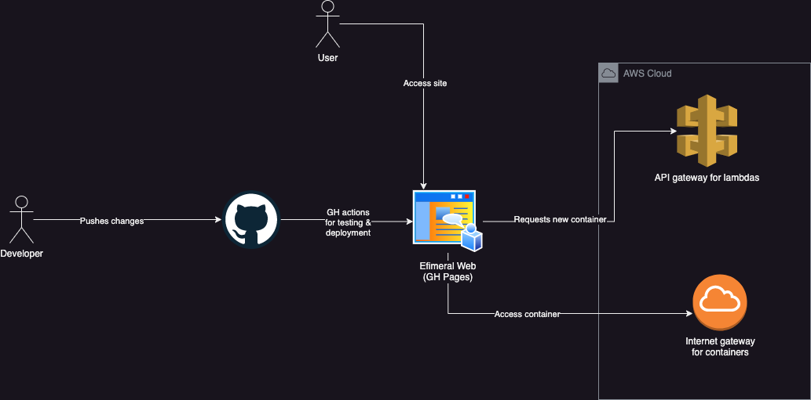

# Efimeral Web

It is a very simple React application that access the API to obtain a container
URL and integrate it as an iframe.

## Related projects

* [Efimeral images](https://github.com/ariel17/efimeral-images)
* [Efimeral infrastructure](https://github.com/ariel17/efimeral-infra)
