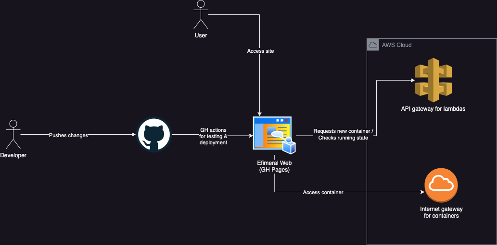

 

# Efimeral Web

It is a very simple React application that access the API to obtain a container
URL and integrate it as an iframe.

## Resources

* [Deploy React App using GitHub Actions](https://dev.to/achukka/deploy-react-app-using-github-actions-157d)

## Related projects

* [Efimeral images](https://github.com/ariel17/efimeral-images)
* [Efimeral API](https://github.com/ariel17/efimeral-api)
